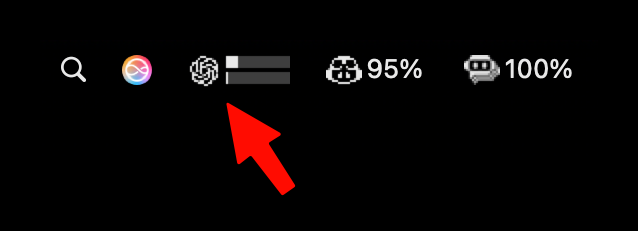

# Codex usage and rate monitoring — SwiftBar/xbar Plugin

A SwiftBar / xbar plugin that displays Codex/OpenAI rate-limit utilization in the macOS menu bar, polling every 5 minutes.

It shows the 5-hour and weekly usage windows as either a compact dual progress-bar icon or percentage text, with reset timing in the dropdown when available.



## Requirements

- macOS
- [SwiftBar](https://github.com/swiftbar/SwiftBar) or [xbar](https://xbarapp.com)
- Codex CLI installed and signed in, or Codex OAuth credentials available in `~/.codex`
- `curl` and `python3` (both ship with macOS)

## Installation

1. Install SwiftBar if needed:

        brew install swiftbar

2. Copy the plugin to your SwiftBar plugins folder:

        cp codex_usage.5m.sh ~/path/to/swiftbar/plugins/

3. Make it executable:

        chmod +x ~/path/to/swiftbar/plugins/codex_usage.5m.sh

4. Click **Refresh All** in SwiftBar or wait for the next poll cycle.

The `5m` in the filename tells SwiftBar to run the script every 5 minutes. Rename the file to change the interval, for example `codex_usage.1m.sh` or `codex_usage.15m.sh`.

## Output

By default (`VAR_SHOW_BARS=true`), the menu bar title is a compact dual progress-bar icon: the top bar represents the 5-hour window and the bottom bar represents the weekly window.

When `VAR_SHOW_BARS=false`, the title falls back to the Codex/OpenAI icon with percentage text:

```text
45%
```

With `VAR_SHOW_7D=true` and `VAR_SHOW_BARS=false`, both windows appear as text:

```text
45%/23%
```

The dropdown shows the 5-hour and weekly windows:

```text
5h window
5h: 45% █████████░░░░░░░░░░░
Resets in: 2h 30m
---
Weekly window
7d: 23% █████░░░░░░░░░░░░░░░
Resets in: 4d 2h
---
Refresh
```

It also includes links to ChatGPT usage, OpenAI status, and a SwiftBar refresh action.

## Configuration

Edit the `xbar.var` lines at the top of `codex_usage.5m.sh`, or use SwiftBar's variable editor.

| Variable | Default | Description |
|---|---:|---|
| `VAR_SHOW_BARS` | `true` | Show a dynamic dual progress-bar icon instead of percentage text |
| `VAR_SHOW_7D` | `false` | Also show weekly usage in the text title; only applies when `VAR_SHOW_BARS=false` |
| `VAR_COLORS` | `true` | Color-code the text title at warning and critical thresholds |
| `VAR_SHOW_RESET` | `true` | Show time-until-reset in the dropdown |
| `VAR_SHOW_PACE` | `false` | Show expected weekly pace in the dropdown |
| `VAR_SOURCE` | `auto` | Usage source: `auto`, `oauth`, or `cli` |

Color thresholds for text titles:

| Utilization | Color |
|---|---|
| `< 70%` | default |
| `>= 70%` | yellow (`#FFD700`) |
| `>= 90%` | red (`#FF0000`) |

## How It Works

In `auto` mode, the plugin first tries Codex OAuth usage data from the local Codex auth/config files, then falls back to parsing `codex /status` output through the CLI. Parsed usage is cached briefly in `/tmp` to match the SwiftBar refresh interval.

The script uses Bash plus inline `python3` stdlib code for JSON parsing, date math, and dynamic PNG generation. No `jq`, `bc`, or third-party Python packages are required.
